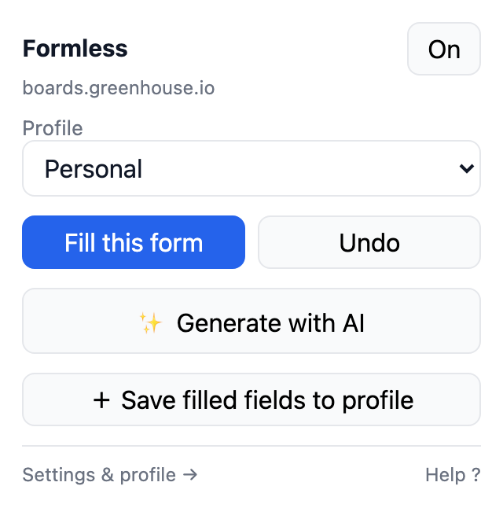
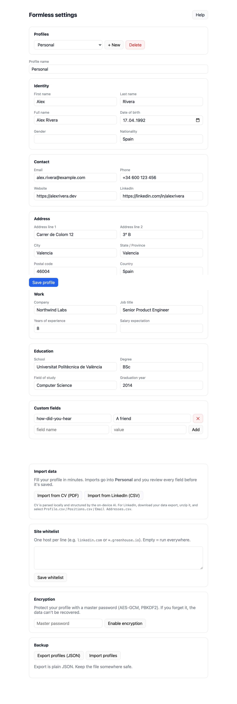

<p align="center">
  
</p>

<p align="center">
  <strong>Fill forms from a local, encrypted profile — and draft the long answers with on-device AI.</strong><br>
  No account. No server. Your data never leaves your browser.
</p>

<p align="center">
  <a href="LICENSE"></a>
  <a href="https://github.com/itchernetski/formless/actions/workflows/ci.yml"></a>
  
</p>

---

Job applications, checkouts, visa forms, conference sign-ups — the same forty fields, over and over. Browser autofill covers name and email, then gives up exactly where the work starts: the cover letter, the "why this company", the "tell us about yourself".

Formless does both halves. It maps form fields to a profile you own, and it drafts the long-form answers from your CV using the AI model built into your browser. Everything runs on your machine.

<p align="center">
  
</p>

## Why it's different

- **Local-first, not "privacy-friendly".** There is no backend to send data to. The profile lives in IndexedDB and can be encrypted at rest with AES-GCM (PBKDF2-derived key, 210k iterations). The unlocked key sits in `chrome.storage.session` and dies with the browser session.
- **AI without an API key.** Generation uses Chrome's built-in Gemini Nano. No key to paste, no subscription, no prompt leaving the device.
- **It learns from you.** Fill a form by hand once, hit *Save filled fields to profile*, and Formless reverse-maps what you typed into your profile — with passwords, card numbers, CVV, OTP, PIN and SSN filtered out before you ever see the review screen.
- **You stay in control.** Every import and capture goes through a diff you approve field by field. Formless fills and drafts; it never submits, and it never touches CAPTCHAs or bot detection.
- **Real MIT open source.** Auditable end to end, because "trust us with your identity documents" is not a value proposition.

## Features

| | |
|---|---|
| **Autofill** | Heuristic mapping over `autocomplete`, `name`, `id`, `placeholder`, `<label>` and `aria-label`, with weighted scoring and a confidence threshold. Handles React/Vue controlled inputs via native value setters, plus select, checkbox, radio, textarea, date and shadow DOM. |
| **AI drafting** | Reads page context (JSON-LD `JobPosting` → OpenGraph → DOM) and drafts cover letters, bios and "why this company" answers. Choose type, tone and length; stream, edit, then insert. |
| **Import** | CV as PDF (parsed locally with pdf.js, structured by the on-device model) or a LinkedIn data export (`Profile.csv`, `Positions.csv`, `Email Addresses.csv`). |
| **Capture** | Reverse-maps hand-typed values back into your profile, deduped and diffed, with one-step undo. |
| **Profiles** | Several profiles (Personal / Work / per-role), switchable straight from the popup. |
| **Safety rails** | Per-site whitelist, master on/off, sensitive-field blocklist, fill undo, JSON export for backup. |

## Install

### From source (current path)

```bash
git clone https://github.com/itchernetski/formless.git
cd formless
npm install          # also installs extension/
npm run build        # → extension/dist
```

Then load it:

1. Open `chrome://extensions`
2. Enable **Developer mode**
3. **Load unpacked** → select `extension/dist`

Works in Chrome, Edge, Brave and other Chromium browsers. AI generation additionally needs Chrome with Built-in AI available — check `chrome://on-device-internals`. Everything else works without it.

### From a store

Not published yet. See [`docs/store-listing.md`](docs/store-listing.md) for the submission material and current status.

## Using it

Click the toolbar icon, then:

- **Fill this form** — map and fill the current page. Filled fields flash green; **Undo** reverts.
- **✨ Generate with AI** — opens a panel on the page for long text fields.
- **＋ Save filled fields to profile** — learn from what you typed by hand.
- **Help ?** — the bundled help page, which works offline and makes no network requests.

Full walkthrough and troubleshooting live in the extension itself (**Help**) — no need to come back here.

<p align="center">
  
</p>

## Privacy

Free tier makes **zero** network requests. Not "anonymised telemetry" — zero. No analytics, no crash reporting, no remote config. The full statement is in [PRIVACY.md](PRIVACY.md).

Permissions and why each is needed:

| Permission | Why |
|---|---|
| `storage` | Profile and settings in IndexedDB / `chrome.storage.session` |
| `activeTab` | Know which page you clicked on |
| `http://*/*`, `https://*/*` content script | Detect and fill forms on the page you're looking at. Narrow it further with the site whitelist. |

No `host_permissions` for remote servers, because there are none.

## Architecture

```
extension/
├── manifest.config.ts       # MV3 manifest (typed, built by @crxjs/vite-plugin)
├── src/
│   ├── vault/               # IndexedDB + AES-GCM at rest, profiles, settings
│   ├── detection/           # field signals, scoring, fill, capture, sensitive-field blocklist
│   ├── ai/                  # provider interface + local/ (Gemini Nano, WebLLM slot)
│   ├── import/              # PDF/CV, LinkedIn CSV, diff & merge
│   ├── content/             # content script, overlay, AI panel
│   ├── background/          # service worker
│   ├── popup/ options/ help/  # React UI
│   └── shared/              # messaging contracts, utils
└── tests/                   # Vitest + jsdom
scripts/                     # packaging, screenshot generation
landing/                     # static landing page
```

TypeScript + Vite + React + Vitest. Details and the rationale behind each decision: [`docs/plan-form-autofill.md`](docs/plan-form-autofill.md).

## Development

```bash
npm run dev          # Vite dev server with HMR
npm test             # Vitest (68 tests)
npm run typecheck
npm run lint
npm run build
npm run package      # store-ready zips → release/
```

Screenshots in this README are generated, not hand-captured:

```bash
node scripts/screenshots.mjs   # → docs/assets/
```

## Contributing

Yes please — especially **site reports**. If Formless mis-fills or ignores a form, an issue with the URL and what you expected is the single most useful contribution, because field-detection coverage grows case by case. See [CONTRIBUTING.md](CONTRIBUTING.md).

Security issues: [SECURITY.md](SECURITY.md) — please don't open a public issue.

## Roadmap

Shipped: local profile + autofill, on-device AI generation, CV/LinkedIn import, form capture, multi-profile.

Next, and deliberately not before there's demand for it: an optional paid tier — a thin proxy to Claude for higher-quality drafting, and end-to-end encrypted sync between devices. The local tier stays free and functional forever; that is the point of the project, not a lead-in to a paywall. Details in [`docs/plan-form-autofill.md`](docs/plan-form-autofill.md).

## License

MIT © Ilya Chernetskiy
